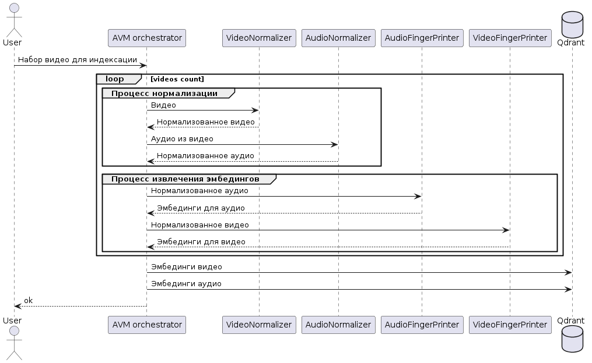
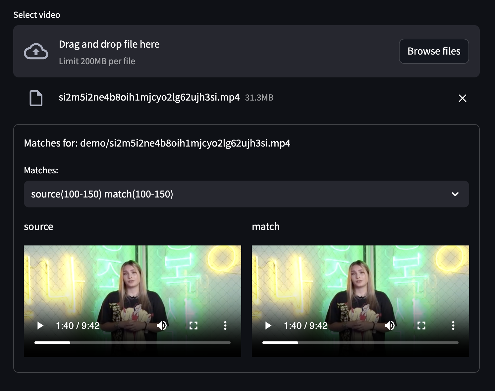

# Техническая документация


# Быстрый старт

```
bash scripts/data/download_demo_files.sh
docker-compose up
# перейти на демо урл
```

# Глоссарий
* **Эмбэддинг** -- это вектор, который характеризует отрывок видео/аудио. Его генерит нейронка.
* **Фингерпринт** -- отпечаток аудио/видео, представляет из себя упорядоченную последовательность эмбэддингов

# Общая архитектура решения

В текущем решении упор сделан на матчинг по аудио.
Так как в требованиях было описано, что именно эта модальность
подверглась наименьшим искажениям.

Слепки видео используются только как способ уточнить
интервалы, полученные с помощью алгоритма для поиска
взаимствований по аудио. В этом тесте можно посмортеть
пример работы коррекции на основе видео-ряда [test_trim_intervals_with_visual_modality()](https://github.com/mrsndmn/lct_2024/blob/229e625dd7df73285649152cdeefa8609ccff509/src/avm/matcher_test.py#L302)

Общая схема работы разработанной системы:

1. Нормализация видео и аудио, выделение аудио в отдельный файл.
2. Получение слепков для обоих модальностей -- этот процесс параллелится для модальностей независимо.
3. Поиск -- бизнес-логика, основанная на эвристиках и векторном поиске.

# Процесс предобработки видео/аудио
[Скрипт для нормализации видео](https://github.com/mrsndmn/lct_2024/blob/495b5aa12ed23b07e0e818dbe46e7640ccf06946/scripts/normalization/normalize_video_ffmpeg.py)

Алгоритм нормализации видео:
1. Фильтруем видео с длительностью <60 секунд
2. Приводим к FPS=1
3. Приводим к разрешению 224*224
4. Делаем видео черно-белым
5. Обрезаем черные рамки при их наличии


[Нормализация аудио](https://github.com/mrsndmn/lct_2024/blob/4a70142f35d19a7eea37b91cddfaaeed08a6b457/scripts/data/extract_audio_from_video.py#L37)

Алгоритм нормализации аудио:
1. Устанавливаем кодек pcm_s16le
2. Приводим частоту дискретизации к значению 16000 Гц
3. Устанавливаем количество аудиоканалов = 1

# Процесс получения слепка

## Получение слепка для аудио

Для получения слепков использовалась уменьшенная модель `UniSpeechSatForXVector`
с небольшими доработками для обучения с помощью ф-ии потерь `CLIP`.

Количество обучаемых параметров `~11М`.

Эта модель на вход принимает сырую волну (не мелспектрограмму),
предобрабатывает с помощью сверток, уменьшая размерность последовательности,
и на меньших размерностях применяет слои внимания, трансформерные блоки.

Для обучения с помощью ф-ии потерь `CLIP` нужна пара данных.
Для нашей задачи это два аугментированных отрезка аудио. К разным
отрезкам применялись разные аугментации.

**Ссылки:**

* [Скрипт обучения модели](https://github.com/mrsndmn/lct_2024/blob/main/scripts/train/audio_finetuning.py)
* [Список аугментаций](https://github.com/mrsndmn/lct_2024/blob/49549c63dbeea60092798cb50ba10c44f9970175/scripts/data/generate_audio_augmentations.py#L73)
* [Веса](https://storage.yandexcloud.net/lct2024-task-14/electric-yogurt-97.zip)


## Получение слепка для видео

Для слепков видео используется скелет от `efficient-net-b0`.

Ф-я потерь точно такая же как для задачи аудио.

Кол-во обучаемых параметров `~7M`.

**Ссылки:**

* [Скрипт обучения модели](https://github.com/mrsndmn/lct_2024/blob/main/scripts/train/image_finetuning.py)
* [Реализация класса](https://github.com/mrsndmn/lct_2024/blob/main/src/avm/models/image.py#L6)
* [Веса](https://storage.yandexcloud.net/lct2024-task-14/ruby-moon-17.zip)


# Процесс загрузки/индексации набора видео в базу


Отдельно обрабатываются аудио и кадры. Для каждого видео выполняется нормализация, формирование фингерпирнтов(эмбедингов) и их сохранение а БД.

# Процесс поиска видео по базе

### Выбор метрики для схожести слепков

Модель была обучена на сближение метрики косинусного расстояния.
Тем не менее, в qdrant есть возможность использовать метрику расстояния
для слепков `Dot`. Результаты вычисления `Dot` метрики для нормализованных
векторов точно такие же как для `Cosine` метрики. При этом вычислять
`Dot`-расстояние вичислительно более эффективно.

Правильный выбор метрики ускоряет поиск по индексу
```
# тест-бенчмарк, как расстояние влияет
# на скорость работы векторного поиска
pytest -s src/avm/search/audio_test.py

metric=Dot     embedding_size=64       time=0.005
metric=Dot     embedding_size=128      time=0.007
metric=Dot     embedding_size=256      time=0.009
metric=Dot     embedding_size=512      time=0.012

metric=Cosine  embedding_size=64       time=0.022
metric=Cosine  embedding_size=128      time=0.038
metric=Cosine  embedding_size=256      time=0.081
metric=Cosine  embedding_size=512      time=0.114
```

Из результатов бенчмарка можно заметить, что `Dot` метрика
всегда быстрее чем `Cosine` при одинаковой размерности.
При этом результат расстояния одинаковый в случае, если слпепки
заранее нормализованы. Поэтому в текущем проекте будет использоваться
именно `Dot` метрика.

Так же учеличение размености слепка приводит к замедлению индекса.
Слепки большей размерности несут большее кол-во информации, но и
занимают больше оперативной памяти.
В качестве коммпромисса между скоростью поиска в векторном пространстве
и кол-вом информации в слепке была выбрана разменость слепков 256.

#### Алгоритм поиска взаимствований по аудио


Для каждого файла-запроса генерируются эмбэддинги
с определенными гипер-параметрами. Гиперпараметры
подбирались на валидационном датасете перебором (см приложение 1).

Максимальное значение финальной метрики на валидационном датасете
-- `0.749` с парамтерами:
```
interval_duration           5 # в секундах
query_interval_step         3 # в секундах
threshold                   0.9
```

[Эвристики](https://github.com/mrsndmn/lct_2024/blob/main/src/avm/matcher.py#L91), которые используются для обработки интервалов:
* Очень короткие интервалы не могут быть валидными
* Если в последовательности интервалов встречается какой-то интервал из другого индексного видео,
такой интервал нужно отбросить -- это ложно положительное срабатывание.


#### Алгоритм поиска взаимствований по видео


## Возможные оптимизации

Сейчас самой дорогой по вычислительным ресурсам частью системы
является создание эмбэддингов. Сейчас эмбэддинги генерируются
с маленьким шагом и большим пересечением. При это получается, что
данные из пересечения интервалов проходят через нейросетьнесколько раз.

Для контекстно-локальных слоев (сверточных) это можно оптимизировать и вычислять
свертоеные слои один раз. А для контекстно-зависимые слои (механизм внимания)
запускать с пересечениями на уже предобработанных свертками активациях.


# Основные взаимодействия с интерфейсом системы.


Для выбранного файла будет выведен список из N видео в которых найдены заимствования. 
Для каждого найденного видео можно переключаться между интервалами.

# Масштабируемость 

Сервис проверки заимстований (AVM) отвечает за нормализацию видео и извлечение эмбединогов, а также за бизнес логику по оределению заимстований. Этот сервис - stateless соответственно может легко масштабироваться как вертикально так и горизонтально без ограничений.  
Qdrant используется для хранения эмбедингов и поиска KNN. Может масштабироваться вертикально и горизонтально (шардирование). Возможности горизонтального масштабирования ограничены. 

-------


# Отчет

Сюда будем фиксировать структуру отчета и экспериментов, которые мы будем питчить.

Можно записывать вопросы, на которые хочется ответить в результате работы.

* Как влияет размерность после применения PCA на качество?
* Как повлияет квантизация?
* Как влияет добавление последовательности векторов? Вместо одного вектора на всю аудюшку?

* Исследовать или погуглить про advversarial атаки на такие системы матчинга -- как от них зачититься?

# Какие процессы можно распараллелить? - нарисовать сиквенс диаграмму

Рассказать, что мы подумали про удаление слепков из индекса.

## Расчет производительности и необходимого затраченого времени:

Скорость матчинга по аудио:
* x60 от realtime скорости
* если в сутки заливается 5к часов видео, потребуется ~84 часа на вычисление слепков
* слепки одного часа видео занимают 6Мb
* в памяти индекс рутуба весит 7 GB с учетом индекса

* выйграем ли мы от каскадирования?

### Гипотезы

Вычисления для матчинга разбиваем на 4 этапа:
* нормализация
* предобработка
* вычисление контекстных эмбэддингов - запуск самого тела нейронки с ограниченным контекстом (основная вычислительная нагрузка)
* вычисление эмбэддингов интервалов - пуллинг интервалов с предыдущего слоя (дешево)

TODO возможно, понижение размерности или квантизация

## Генерация эмбэддингов:
* можно ускорить, если один раз предобрабатывать пересекающиеся интервалы для контекстонезависимых слоев

## Матчинг:

* Иногда попадаются рандомные интервалы - их можно отсеять с помощью эвристик
* Тк в пиратском видео данные могут быть с небольшим или большим оффсетом -- нужно генерить эмбэддинги с маленьким шагом и оптимизация пуллинга в этом нам помогает


# Приложение 1

## Как трешолд и количество эмбэддингов в интервалах влияет на результирующую метрику?

**Скрипт** - `scripts/evaluate/process_query_hits.py`

Длинна одного интервала = 5 секунд

*Выводы:* наибольшее значение итоговой метрики достгается при пересечении интервалов
примерно на половину или чуть больше половины.

Максимальное значение метрики = `0.749` с парамтерами:
```
query_interval_step         3
threshold                   0.9
```

С маленькими интервалами пересечения качество падает.
При пересеченнии стремящемся к длинне самого интервала тоже качество падает.

```
============================================
query_interval_step         1
query_hits_intervals_step   1
threshold 0.86  final_iou 0.504         f1 0.821        final_metric_value 0.624
threshold 0.87  final_iou 0.517         f1 0.826        final_metric_value 0.636
threshold 0.88  final_iou 0.515         f1 0.818        final_metric_value 0.632
threshold 0.89  final_iou 0.521         f1 0.819        final_metric_value 0.637
threshold 0.9   final_iou 0.534         f1 0.828        final_metric_value 0.649
threshold 0.91  final_iou 0.535         f1 0.821        final_metric_value 0.647
threshold 0.92  final_iou 0.561         f1 0.84         final_metric_value 0.673
threshold 0.93  final_iou 0.608         f1 0.86         final_metric_value 0.713
threshold 0.94  final_iou 0.599         f1 0.852        final_metric_value 0.704
threshold 0.95  final_iou 0.593         f1 0.854        final_metric_value 0.7
threshold 0.96  final_iou 0.517         f1 0.824        final_metric_value 0.635
threshold 0.97  final_iou 0.421         f1 0.78         final_metric_value 0.547
threshold 0.98  final_iou 0.245         f1 0.662        final_metric_value 0.358
threshold 0.99  final_iou 0.051         f1 0.395        final_metric_value 0.09


============================================
query_interval_step         2
query_hits_intervals_step   2
threshold 0.86  final_iou 0.6   f1 0.884        final_metric_value 0.714
threshold 0.87  final_iou 0.595         f1 0.878        final_metric_value 0.709
threshold 0.88  final_iou 0.594         f1 0.872        final_metric_value 0.706
threshold 0.89  final_iou 0.619         f1 0.884        final_metric_value 0.728
threshold 0.9   final_iou 0.609         f1 0.874        final_metric_value 0.718
threshold 0.91  final_iou 0.6   f1 0.869        final_metric_value 0.71
threshold 0.92  final_iou 0.62  f1 0.877        final_metric_value 0.726
threshold 0.93  final_iou 0.617         f1 0.878        final_metric_value 0.725
threshold 0.94  final_iou 0.623         f1 0.88         final_metric_value 0.73
threshold 0.95  final_iou 0.586         f1 0.871        final_metric_value 0.701
threshold 0.96  final_iou 0.486         f1 0.839        final_metric_value 0.616
threshold 0.97  final_iou 0.341         f1 0.752        final_metric_value 0.47
threshold 0.98  final_iou 0.205         f1 0.629        final_metric_value 0.309
threshold 0.99  final_iou 0.029         f1 0.323        final_metric_value 0.053


============================================
query_interval_step         3
query_hits_intervals_step   3
threshold 0.86  final_iou 0.611         f1 0.874        final_metric_value 0.72
threshold 0.95  final_iou 0.586         f1 0.871        final_metric_value 0.701                              [11/1962]
threshold 0.96  final_iou 0.486         f1 0.839        final_metric_value 0.616
threshold 0.97  final_iou 0.341         f1 0.752        final_metric_value 0.47
threshold 0.98  final_iou 0.205         f1 0.629        final_metric_value 0.309
threshold 0.99  final_iou 0.029         f1 0.323        final_metric_value 0.053


============================================
query_interval_step         3
query_hits_intervals_step   3
threshold 0.86  final_iou 0.611         f1 0.874        final_metric_value 0.72
threshold 0.87  final_iou 0.619         f1 0.877        final_metric_value 0.726
threshold 0.88  final_iou 0.629         f1 0.877        final_metric_value 0.733
threshold 0.89  final_iou 0.64  f1 0.879        final_metric_value 0.741
threshold 0.9   final_iou 0.649         f1 0.885        final_metric_value 0.749
threshold 0.91  final_iou 0.633         f1 0.886        final_metric_value 0.738
threshold 0.92  final_iou 0.62  f1 0.877        final_metric_value 0.726
threshold 0.93  final_iou 0.587         f1 0.866        final_metric_value 0.7
threshold 0.94  final_iou 0.554         f1 0.856        final_metric_value 0.673
threshold 0.95  final_iou 0.484         f1 0.833        final_metric_value 0.612
threshold 0.96  final_iou 0.366         f1 0.768        final_metric_value 0.496
threshold 0.97  final_iou 0.245         f1 0.681        final_metric_value 0.361
threshold 0.98  final_iou 0.136         f1 0.553        final_metric_value 0.218
threshold 0.99  final_iou 0.018         f1 0.268        final_metric_value 0.033
```

## Длинна интервала 10 секунд 

При увеличении длинны интервала получаем плохие значения метрик.
Возможно, из-за того, что моделька обучалась именно на 5-секундных интервалах.

Увеличение длинны интервала немного удлинняет скорость генерации фингерпринтов.
В 2 раза.


```
query_interval_step         1
query_hits_intervals_step   1
threshold 0.86  final_iou 0.053         f1 0.128        final_metric_value 0.075
threshold 0.88  final_iou 0.088         f1 0.202        final_metric_value 0.122
threshold 0.9   final_iou 0.17           f1 0.35         final_metric_value 0.229
threshold 0.92  final_iou 0.234         f1 0.441        final_metric_value 0.306
threshold 0.94  final_iou 0.268         f1 0.498        final_metric_value 0.348
threshold 0.96  final_iou 0.304         f1 0.546        final_metric_value 0.391
threshold 0.98  final_iou 0.256         f1 0.524        final_metric_value 0.344


============================================
query_interval_step         2
query_hits_intervals_step   2
threshold 0.86  final_iou 0.071         f1 0.162        final_metric_value 0.099
threshold 0.88  final_iou 0.117         f1 0.253        final_metric_value 0.16
threshold 0.9   final_iou 0.211         f1 0.412        final_metric_value 0.279
threshold 0.92  final_iou 0.273         f1 0.498        final_metric_value 0.353
threshold 0.94  final_iou 0.279         f1 0.511        final_metric_value 0.361
threshold 0.96  final_iou 0.297         f1 0.544        final_metric_value 0.384
threshold 0.98  final_iou 0.209         f1 0.493        final_metric_value 0.293


============================================
query_interval_step         3
query_hits_intervals_step   3
threshold 0.86  final_iou 0.078         f1 0.189        final_metric_value 0.111
threshold 0.88  final_iou 0.126         f1 0.289        final_metric_value 0.176
threshold 0.9   final_iou 0.219         f1 0.449        final_metric_value 0.294
threshold 0.92  final_iou 0.26          f1 0.509        final_metric_value 0.344
threshold 0.94  final_iou 0.266         f1 0.527        final_metric_value 0.353
threshold 0.96  final_iou 0.277         f1 0.551        final_metric_value 0.368
threshold 0.98  final_iou 0.17          f1 0.491        final_metric_value 0.253


============================================
query_interval_step         4
query_hits_intervals_step   4
threshold 0.86  final_iou 0.09          f1 0.211        final_metric_value 0.126
threshold 0.88  final_iou 0.156         f1 0.341        final_metric_value 0.214
threshold 0.9   final_iou 0.232         f1 0.466        final_metric_value 0.31
threshold 0.92  final_iou 0.269         f1 0.516        final_metric_value 0.353
threshold 0.94  final_iou 0.268         f1 0.523        final_metric_value 0.355
threshold 0.96  final_iou 0.269         f1 0.55         final_metric_value 0.361
threshold 0.98  final_iou 0.152         f1 0.486        final_metric_value 0.231


============================================
query_interval_step         5
query_hits_intervals_step   5
threshold 0.86  final_iou 0.098         f1 0.234        final_metric_value 0.138
threshold 0.88  final_iou 0.16          f1 0.363        final_metric_value 0.222
threshold 0.9   final_iou 0.235         f1 0.476        final_metric_value 0.314
threshold 0.92  final_iou 0.252         f1 0.506        final_metric_value 0.337
threshold 0.94  final_iou 0.269         f1 0.536        final_metric_value 0.358
threshold 0.96  final_iou 0.269         f1 0.557        final_metric_value 0.363
threshold 0.98  final_iou 0.11          f1 0.431        final_metric_value 0.175


============================================
query_interval_step         6
query_hits_intervals_step   6
threshold 0.86  final_iou 0.108         f1 0.256        final_metric_value 0.152
threshold 0.88  final_iou 0.172         f1 0.387        final_metric_value 0.238
threshold 0.9   final_iou 0.259         f1 0.513        final_metric_value 0.344
threshold 0.92  final_iou 0.27          f1 0.534        final_metric_value 0.359
threshold 0.94  final_iou 0.267         f1 0.539        final_metric_value 0.357
threshold 0.96  final_iou 0.258         f1 0.554        final_metric_value 0.352
threshold 0.98  final_iou 0.122         f1 0.457        final_metric_value 0.192


============================================
query_interval_step         7
query_hits_intervals_step   7
threshold 0.86  final_iou 0.133         f1 0.306        final_metric_value 0.185
threshold 0.88  final_iou 0.208         f1 0.442        final_metric_value 0.283
threshold 0.9   final_iou 0.242         f1 0.498        final_metric_value 0.326
threshold 0.92  final_iou 0.26          f1 0.529        final_metric_value 0.349
threshold 0.94  final_iou 0.267         f1 0.549        final_metric_value 0.359
threshold 0.96  final_iou 0.242         f1 0.535        final_metric_value 0.333
threshold 0.98  final_iou 0.125         f1 0.444        final_metric_value 0.195


============================================
query_interval_step         8
query_hits_intervals_step   8
threshold 0.86  final_iou 0.117         f1 0.289        final_metric_value 0.167
threshold 0.88  final_iou 0.171         f1 0.392        final_metric_value 0.238
threshold 0.9   final_iou 0.206         f1 0.451        final_metric_value 0.283
threshold 0.92  final_iou 0.229         f1 0.492        final_metric_value 0.312
threshold 0.94  final_iou 0.235         f1 0.523        final_metric_value 0.324
threshold 0.96  final_iou 0.189         f1 0.498        final_metric_value 0.274
threshold 0.98  final_iou 0.058         f1 0.337        final_metric_value 0.099


============================================
query_interval_step         9
query_hits_intervals_step   9
threshold 0.86  final_iou 0.14          f1 0.335        final_metric_value 0.198
threshold 0.88  final_iou 0.197         f1 0.443        final_metric_value 0.273
threshold 0.9   final_iou 0.23          f1 0.498        final_metric_value 0.315
threshold 0.92  final_iou 0.236         f1 0.518        final_metric_value 0.324
threshold 0.94  final_iou 0.226         f1 0.523        final_metric_value 0.316
threshold 0.96  final_iou 0.179         f1 0.511        final_metric_value 0.265
threshold 0.98  final_iou 0.065         f1 0.386        final_metric_value 0.111


============================================
query_interval_step         10
query_hits_intervals_step   10
threshold 0.86  final_iou 0.156         f1 0.373        final_metric_value 0.22
threshold 0.88  final_iou 0.213         f1 0.478        final_metric_value 0.295
threshold 0.9   final_iou 0.235         f1 0.506        final_metric_value 0.321
threshold 0.92  final_iou 0.24          f1 0.52         final_metric_value 0.328
threshold 0.94  final_iou 0.247         f1 0.541        final_metric_value 0.339
threshold 0.96  final_iou 0.193         f1 0.525        final_metric_value 0.282
threshold 0.98  final_iou 0.076         f1 0.391        final_metric_value 0.127
```
